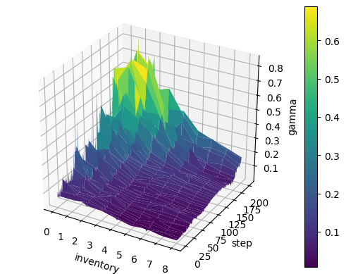
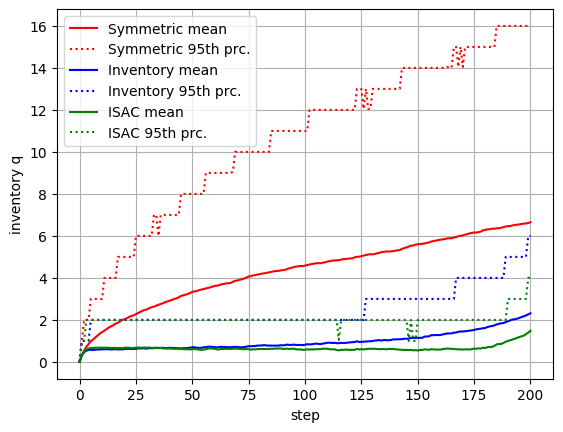
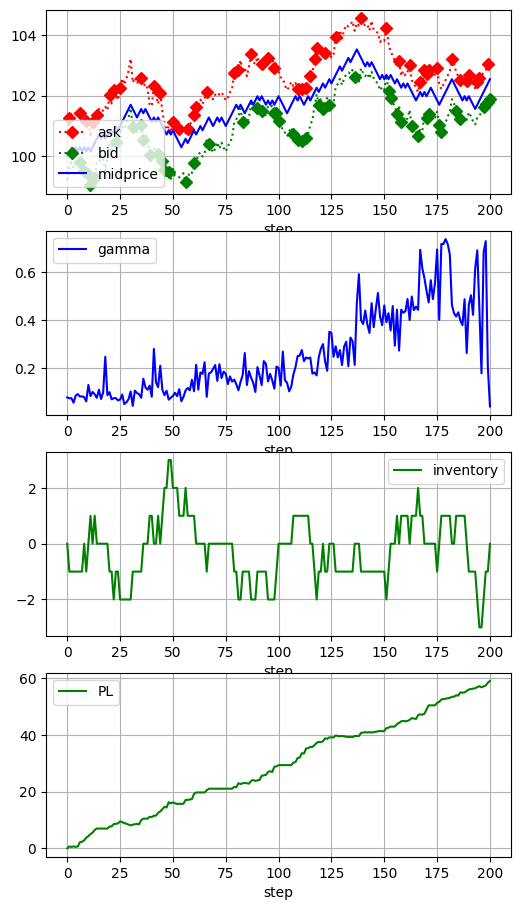

# Optimal control of risk aversion in Avellaneda Stoikov high frequency market making model with Soft Actor Critic reinforcement learning

## Description
Inventory Soft Actor Critic (ISAC) is an experimental extension of Inventory strategy described by Avellaneda and Stoikov[[1]](#references). 
Numerical simulations described in [[1]](#references) have risk aversion parameter gamma configured arbitrarily. 
ISAC uses soft actor critic (SAC)[[2]](#references) to control gamma. 
Two dimensional state space is defined with absolute value of inventory q and remaining time (total time - step * dt), while one dimensional action space is gamma. 
Reward is defined as a change in agents value (PL) discounted by penalty function. 
Penalty is proportional to volatility in mark to market value of inventory.  
Strategy is trained on 2000 simulated price paths containing 200 steps each.
Benchmark is performed on 2000 simulated paths against inventory and symmetric strategy. 
Simulation settings are identical to ones described in [[1]](#references). 
Inventory and symmetric strategies have gamma configured to 0.1 as such setting produces most attractive PL profile for given simulation settings.

## Running the code
- run_as.py – Inventory and Symmetric strategy numerical simulations, replication of Avellaneda and Stoikov[[1]](#references)
- run_experiment.py – train ISAC strategy, benchmark against Inventory and Symmetric, visualization of results

**Note:** plots are saved to results folder

#### Requirements
- PyTorch
- Numpy
- Matplotlib

## Results

**Benchmark statistics:** Terminal PL and abs(q)

|   	|   Symmetric	 | Inventory   	| ISAC  	|
|---	|---	|---	|---	|
| mean(PL)   	|   68.12	|   64.86	|  61.79  	|
| std(PL)|   13.16 (19.33%) 	| 6.45 (9.95%) 	|    6.15 (9.95%)  	|
| mean(\|q\|)  	|    6.65 	| 2.32	|   1.48  	|
| std(\|q\|)|    4.95	|   1.77 	| 1.25 	|

     
  
*Fig. 1: Visualization of learned policy, state space (inventory, step) and action space (gamma)*
     

  
*Fig. 2: Evolution of inventory over time, mean and 95th percentile*
     

  
*Fig. 3: Example of simulated price and system behaviour, diamonds mark filled limit orders*
     

**Note:** Additional plots available in /results_demo/ .

### References
- [[1] Avellaneda, Marco & Stoikov, Sasha. (2008). High Frequency Trading in a Limit Order Book. Quantitative Finance. 8. 217-224. 10.1080/14697680701381228. ](https://www.math.nyu.edu/faculty/avellane/HighFrequencyTrading.pdf)
- [[2] Haarnoja, Tuomas & Zhou, Aurick & Hartikainen, Kristian & Tucker, George & Ha, Sehoon & Tan, Jie & Kumar, Vikash & Zhu, Henry & Gupta, Abhishek & Abbeel, Pieter & Levine, Sergey. (2018). Soft Actor-Critic Algorithms and Applications.  ](https://arxiv.org/pdf/1812.05905.pdf)
 